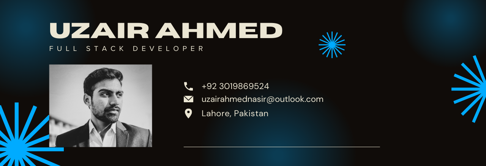

## Aspiring Software Engineer

I'm a 4th Year Computer Science Student and I'm in love with Computers since i was a kid. I like Reverse Engineering, First Principle thinking & learning about underlying hardware. moreover, I'm a huge fan of Gaming & Electronic Music.

- 🌏 Based in Lahore, Pakistan
- 📧 Contact me uzairahmednasir@outlook.com
- 🌱 I’m currently learning Web Development
- 🔭 I plan to get into Computer Graphics & Deep Learning

### Tech Skills

### Creative Tools

